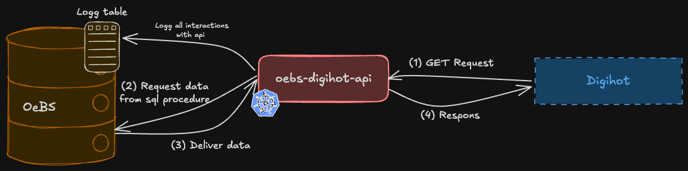

# oebs-digihot-api

REST API service that exposes OEBS Oracle data to the internal NAV service `saas-proxy`.
The service runs in sikker sone (FSS) and provides data about users, passes, orders, service orders, and service requests
by calling PL/SQL procedures in the OEBS Oracle database.

---

## Architecture

The service acts as a bridge between Digihot (GCP) and the OEBS Oracle database (sikker sone).
Incoming requests are authenticated via Azure AD, logged to the database via `KallLogg`, then routed to the
appropriate PL/SQL procedure in the `xxrtv_digihot_api_pkg` package.

---

## Functionality

Digihot needs to look up user-specific data stored in OEBS, such as user numbers, passes, orders, service orders,
and service requests. Because the OEBS Oracle database resides in sikker sone, this service was created to expose
that data through a REST API that Digihot can reach via the FSS pub endpoint.

### Security

All endpoints are protected by Azure AD token validation using the `@Protected` annotation and
`@EnableJwtTokenValidation`. Callers must include a valid Azure AD bearer token in the `Authorization` header.
Token validation is performed by the service itself before any data is returned.

### Endpoints

| Method | Path | Description |
|--------|------|-------------|
| `GET` | `/api/v1/brukernr` | Retrieves OEBS user numbers for a given person |
| `GET` | `/api/v1/brukerpass` | Retrieves user passes for a given person |
| `GET` | `/api/v1/ordre` | Retrieves orders for a given person |
| `GET` | `/api/v1/serviceordre` | Retrieves service orders for a given person |
| `GET` | `/api/v1/serviceforesporsel` | Retrieves service requests for a given person |

**Query parameters (all endpoints):**

| Parameter | Required | Description |
|-----------|----------|-------------|
| `fodsels_nummer` | Yes | 11-digit national identity number |

**Headers:**
- `Authorization` – Required. Bearer token from Azure AD.

### Instances and environments

The service runs with three instances: t1, q1, and prod.

---

## Dependencies

| System | Purpose                                                                                                                         |
|--------|---------------------------------------------------------------------------------------------------------------------------------|
| **OEBS Oracle Database** | Source of all data; queried via PL/SQL procedures in `xxrtv_digihot_api_pkg`. Also stores request/response logs via `KallLogg`. |
| **Digihot / saas-proxy** | Consumer, calls the service from GCP via the FSS pub endpoint                                                                   |
| **NAIS platform** | Container orchestration, secrets management, and deployment                                                                     |

### Consumers  
The only consumer of this service is `saas-proxy`, which is an internal NAV service used by Digihot CRM. Changes that requires
updates on the consumer side (e.g. new endpoints, changes to request/response formats, etc.) must be coordinated
with Digihot CRM in the slack channel [digihot-crm-oebs](https://nav-it.slack.com/archives/C08TUK9K924).

---

## Running Locally

To run the service locally, use the `local` profile and set the following environment variables. Values for all secrets can be retrieved from the NAIS console for the application `oebs-digihot-api-t1`:

- `DB_USERNAME` – username for OEBS
- `DB_PASSWORD` – password for OEBS
- `DB_URL` – URL for OEBS, find in https://confluence.adeo.no/spaces/ITO/pages/39159672/OeBS+Oversikt+over+milj%C3%B8er
- `AZURE_APP_WELL_KNOWN_URL` – discovery URL for the Azure AD app

You must also have connectivity to the OEBS database in the secure zone.
You can either use **vdi-utvikler-oebs** (a VDI set up for development in the secure zone) or the **Global Secure Access Client**.
For more information, see the [oksty developer documentation](https://github.com/navikt/oksty-documentation).

[Swagger UI](http://localhost:8080/swagger-ui/index.html) is available when running locally,
but all endpoints are protected by Azure AD by default. To test endpoints without authentication,
replace the `@Protected` annotation in a controller with `@Unprotected`.

---

## Testing

Unit tests are set up using JUnit and Mockito.

---

## Monitoring and Alerting

No alerting is currently configured. Issues must be detected by users experiencing errors when calling the API, or through observed problems in OEBS that can be traced back to the API.

Standard application monitoring is available via Grafana dashboards:
- [Grafana dashboard for t1](https://grafana.nav.cloud.nais.io/a/nais-apm-app/services/team-oebs/oebs-digihot-api-t1?namespace=team-oebs&environment=dev-fss)
- [Grafana dashboard for q1](https://grafana.nav.cloud.nais.io/a/nais-apm-app/services/team-oebs/oebs-digihot-api-q1?namespace=team-oebs&environment=dev-fss)
- [Grafana dashboard for prod](https://grafana.nav.cloud.nais.io/a/nais-apm-app/services/team-oebs/oebs-digihot-api?namespace=team-oebs&environment=prod-fss)

---

## Deploy

### Branching strategy
- Feature development should happen on dedicated branches with a PR to `main`.
- Merging to `main` triggers deployment to **T1 and Q1** automatically.
- Deployment to **production** requires a manual workflow dispatch with `deploy_prod: true`.

### Referencing Jira tasks
Include the Jira task key in the branch name and/or commit message. All PRs are squash-merged into main, so the most important thing is that the Jira issue is referenced in the squash commit message and that the PR title references the Jira issue. For example, if working on `OEBS-123`, the commit message should include `feat(OEBS-123): new rest endpoint` and the PR title should follow the same format. If a PR covers multiple Jira issues, all should be referenced, e.g. `feat(OEBS-123, OEBS-124): new rest endpoint and tests`. All individual commits should be listed in the PR description.

### Promotion criteria
Before deploying to production:
- All tests must pass (`mvn verify`).
- SonarCloud analysis must not introduce new critical issues.

### Verify after deployment
After deployment, verify that the t1 instance is running and can successfully return data from the OEBS database.
You can do this by sending a test request to one of the endpoints with a valid bearer token and a known `fodsels_nummer`.

---

## Documentation

### Swagger / OpenAPI
Swagger UI is available when the application is running. It can be used to view the API contract and send requests
with a valid Azure AD bearer token.

- [Swagger t1](https://oebs-digihot-api-t1.intern.dev.nav.no/swagger-ui/index.html)
- [Swagger q1](https://oebs-digihot-api-q1.intern.dev.nav.no/swagger-ui/index.html)
- [Swagger prod](https://oebs-digihot-api.intern.nav.no/swagger-ui/index.html)

### System documentation
No system documentation has been found for this service.
